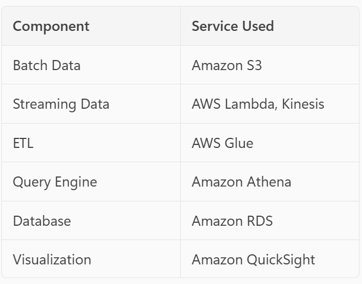

Design Document
1. Overview
This document describes the architecture and design for a data pipeline that ingests batch and streaming data, processes it using AWS Glue, and visualizes insights using Amazon QuickSight. The pipeline ensures scalable, secure, and cost-effective data processing for analytics.

2. Architecture Summary
The architecture consists of the following components:

Data Sources

Batch files: transactions.csv and users.csv
Streaming events: Random click events generated by AWS Lambda and ingested via Amazon Kinesis Data Stream

Storage

Amazon S3: Two zones

Raw Zone: Stores unprocessed batch and streaming data
Processed Zone: Stores transformed and partitioned data in Parquet format

Processing

AWS Glue Job 1: Converts raw data into partitioned Parquet format
AWS Glue Job 2: Loads processed data into Amazon RDS for downstream analytics

Query & Visualization

Amazon Athena: Queries processed Parquet data in S3
Amazon QuickSight: Dashboards for visualization using data from Amazon RDS

3. Data Flow

Batch Data Ingestion

Upload transactions.csv and users.csv to S3 raw bucket.

Streaming Data Ingestion

Lambda generates random click events.
Events flow into Amazon Kinesis Data Stream.
Kinesis Firehose delivers streaming data to S3 raw bucket.

ETL Processing

Glue Job 1:

Reads raw data from S3.
Cleans, transforms, and partitions data into Parquet format.
Writes output to S3 processed bucket.

Query Layer

Athena queries processed Parquet data for ad-hoc analysis.

Data Loading

Glue Job 2:

Reads processed data from S3.
Loads data into Amazon RDS for structured reporting.

Visualization

Amazon QuickSight connects to RDS and creates dashboards.

4. Components & Services

5. Data Storage Design

Raw Zone: S3 bucket for unprocessed data

Prefix: s3://<bucket>/raw/

Processed Zone: S3 bucket for partitioned Parquet data

Prefix: s3://<bucket>/processed/

Partitioning Strategy: By date and event type for optimized queries

6. Security

IAM Roles for Glue, Lambda, Kinesis, Athena, and QuickSight
S3 Bucket Policies for controlled access
Encryption:

S3: SSE-S3 or SSE-KMS
RDS: AES-256 encryption

Network:

VPC for Glue and RDS
Private subnets for database

7. Cost Optimization

Use Glue Job bookmarks for incremental processing
Enable Athena query result reuse
Optimize QuickSight SPICE capacity
Use S3 lifecycle policies for archiving old raw data

8. Monitoring

CloudWatch for Lambda, Glue, and Kinesis metrics
Athena query logs in S3
QuickSight usage metrics

9. Expected Outcomes

Scalable pipeline for batch and streaming data
Efficient storage in Parquet format
Interactive dashboards for business insights
Low-latency queries via Athena and RDS